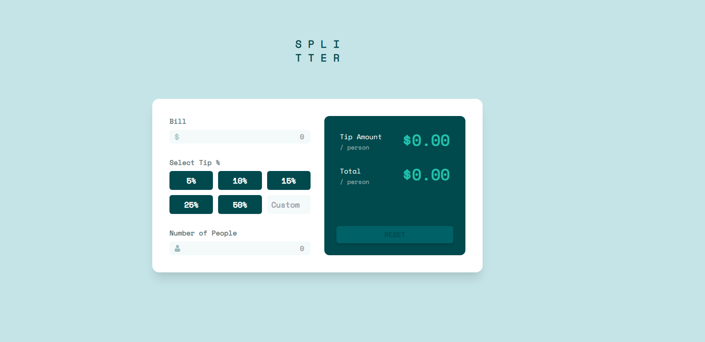

# Tip calculator App

## Description
This is a Tip Calculator App, where you can add the total of your bill, then select the % of the tip you want to give, and write the number of people, and this will calculate the tip.
If you want to see it in live go to https://alexc01.github.io/tip-calculator-app/

## Built With

- Semantic HTL5 
- TailwindCSS 
- Javascript 

